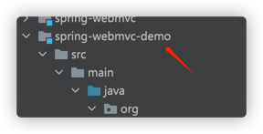
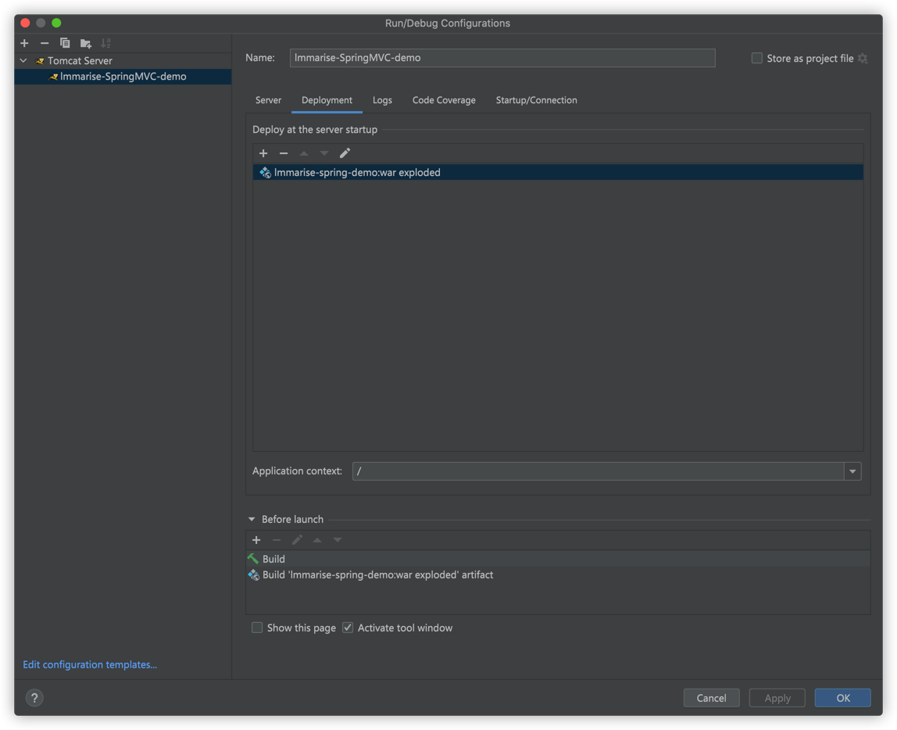
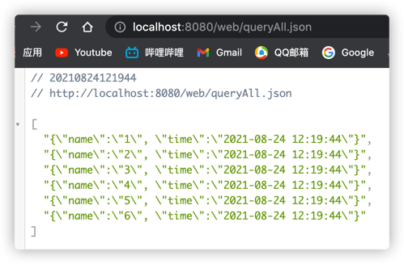
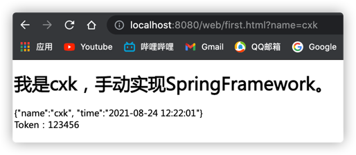
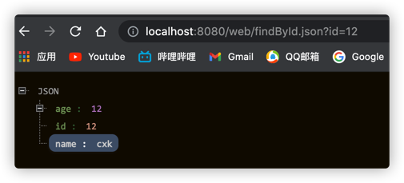
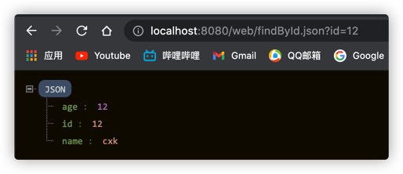
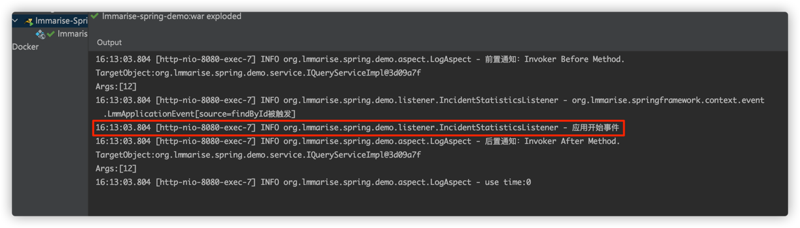

## 介绍
    手动实现 spring framework。

## 约定
    所有的手写类都以 Lmm 开头，以区别于 Spring 框架中的原生类。

## 功能已实现
1. IoC。
   1. DI。
2. AOP。
   1. 前置通知。
   2. 后置通知。
   3. 异常通知。
3. MVC。
4. ORM，过于复杂，半成品。

## 功能待实现
1. 当populationBean时，若autowired字段Bean在容器中不存在，先尝试递归创建字段Bean。✅
2. 加入Bean的单例多例模式
3. 通知。
   1. 环绕通知。
   2. 最终通知。
4. 事件。
   1. 同步事件。✅
   2. 事件异步，多线程实现。
5. Bean注入容器自定义BeanName。
6. Bean根据抽象类型注入。✅
7. 根据泛型注入。
8. 使用三级缓存解决循环依赖。
9. 事物。

## 使用方法
参照demo模块：

## 测试MVC
### 启动

### DEMO

#### MVC

http://localhost:8080/web/queryAll.json  

http://localhost:8080/web/first.html?name=cxk    

http://localhost:8080/web/findById.json?id=12    

#### 事件

http://localhost:8080/web/findById.json?id=12

## 后记
一直以来我都是Spring的使用者，但自从这次尝试自己实现一套类似于Spring核心功能框架，才知道这其中的艰难。 
Spring的代码优雅，结构设计精巧，功能十分强大，可扩展性、重用性以及可读性都非常之高。而鄙人的代码，自认为更像是流水账，开发过程中自己对一些平常的场景下出现某
些异常情况并不能快速的定位，分析及解决问题。 甚至对自己的代码，脑子里都没有足够清晰的流程图。 
Spring的源代码，可以在学习设计模式、场景bug解决参考时都能拿来学习。虽然代码不复杂，没有充斥大量的算法，但是在如此庞大的体量下，还能保持如此之高
的可扩展性，足以见得作者对大型项目掌控能力的功力之深厚。这需要对Java、设计模式有着远超于常人的理解，顶层的抽象同时也异常地重要。像是JavaJDK的
顶层抽象设计，使得Java可以是纯面向对象语言，这无异于要归功于作者天才级的顶层抽象能力。
